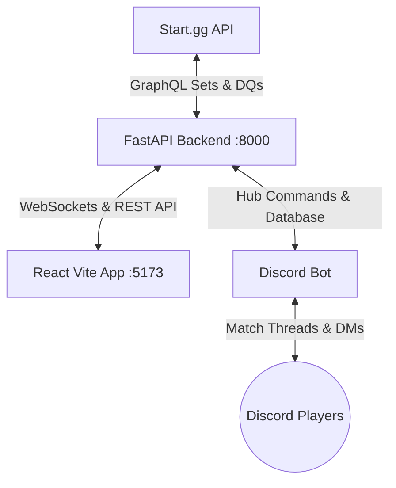
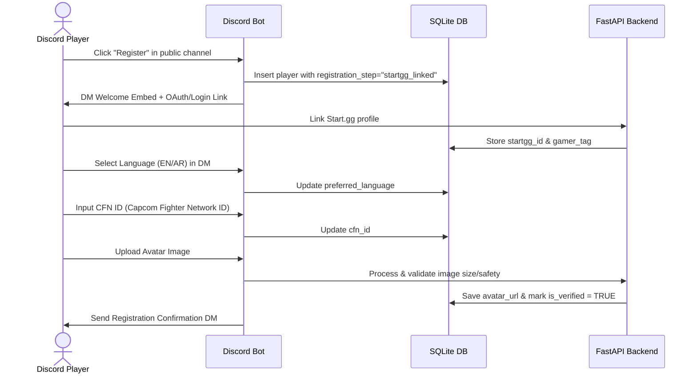
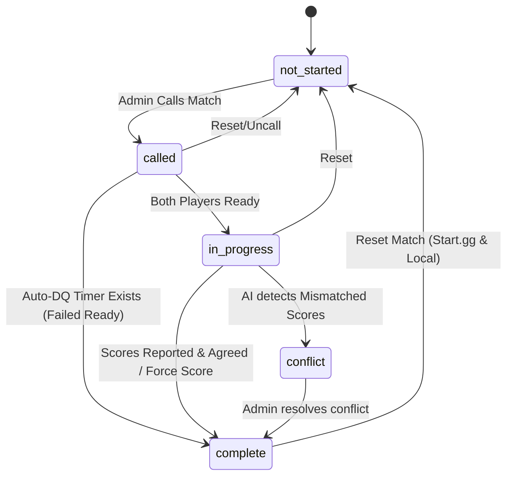

# FNC Tournament Hub: Matches & Tournaments Workflow Reference

This document serves as the local source of truth for the lifecycle, state transitions, and component workflows of tournaments and matches within the AI Tournament Organizer platform. Refer to this to prevent visual and behavioral mismatches when updating the frontend dashboard, Discord bot, or FastAPI backend.

---

## 1. Core Architecture Overview

The platform coordinates real-time data flow between four main boundaries:


* **Vite React App (:5173)**: Displays the tournament dashboard, OBS overlays, and editor. Proxies requests to backend.
* **FastAPI Backend (:8000)**: Serves REST endpoints, drives database queries, manages WebSocket connections, and transitions states.
* **Discord Bot**: Manages player registrations, creates public/private threads, executes ready-checks, polls for hub commands, and runs the LangGraph AI referee.
* **aiosqlite Database**: Persists active matches, registered players, settings, conflicts, and logs.

---

## 2. Player Registration Workflow

Players register via Discord DMs in a bilingual (EN/AR), multi-step flow:



### Registration Rules:
1. **Duplicate Prevention**: If a user is already verified (`is_verified = TRUE`), clicking register offers a profile update flow instead of re-creating the entry.
2. **Purge Policy**: Incomplete registrations (`is_verified = FALSE`) are automatically purged from the database once the tournament’s `registration_deadline` passes.

---

## 3. Match State Machine & Transitions

The lifecycle of an active match is strictly managed by [backend/core/match_state.py](file:///d:/Desktop/AI%20Tournament%20Organizer%20Bot/backend/core/match_state.py).

### State Transitions Table

| From State | Allowed To States | Trigger | Actions & Side Effects |
| :--- | :--- | :--- | :--- |
| **`not_started`** | `called` | Admin clicks "Call Match" or Bot auto-assigns | - Resets score variables to 0.<br>- Clears timer timestamps (`called_at`, `started_at`).<br>- Inserts `call_match {set_id}` command for the Bot to create the Discord thread. |
| **`called`** | `in_progress`<br>`complete`<br>`not_started` | **in_progress**: Both players mark ready.<br>**complete**: Auto-DQ timer expires.<br>**not_started**: Admin resets/cancels. | - **If `called`**: Records `called_at` timestamp. Sets player ready flags to `False`. Runs a 10-minute timeout task.<br>- **If `in_progress`**: Records `started_at` timestamp. Sends `dm_score_request {set_id}` command to Bot. |
| **`in_progress`**| `complete`<br>`not_started` | **complete**: Players report scores, AI Referee matches them, or Admin overrides.<br>**not_started**: Admin resets. | - **If `complete`**: Sends scores/winner to Start.gg via mutation.<br>- **If `not_started`**: Resets score and state variables. |
| **`complete`** | `not_started` | Admin clicks "Reset Match" | - Sends reset mutation to Start.gg.<br>- Sets local state back to `not_started`. |

### Visual State Diagram


---

## 4. Frontend & Visual Sync Rules

To avoid mismatches between what the user sees in the hub and what the state machine represents, follow these design and selection rules:

### A. Dashboard Card Filtering
* **Match Dashboard (Queue View)**: Shows *all* tournament sets fetched from Start.gg.
* **Active Match Status Panel**: Excludes waiting/completed sets. Displays **only** matches undergoing coordination:
  ```typescript
  // Keep synced inside ActiveMatchStatus.tsx
  const activeMatches = matches.filter(
    (m) => m.status === 'in_progress' || m.status === 'called'
  );
  ```

### B. ComfyUI-style Connection Lines
We draw animated Bezier paths in [HubDashboard.tsx](file:///d:/Desktop/AI%20Tournament%20Organizer%20Bot/frontend-react/src/features/hub/HubDashboard.tsx) between active match cards and their assigned streaming stations.
* **Rendering Rule**: A connection line is drawn **only** when a match card exists in the DOM and is actively occupying a station.
  ```typescript
  // Keep synced inside HubDashboard.tsx
  const activeMatches = matches.filter(
    (m) => (m.status === 'in_progress' || m.status === 'called') && m.station_id
  );
  ```
* **DOM Selectors**: Ensure match cards render `id={`active-match-${match.set_id}`}` and stations render `id={`station-${station.id}`}`.

---

## 5. Discord Bot & AI Actions

The Discord bot operates asynchronously by listening to Discord message events and polling the `hub_commands` database table every 3 seconds:

### Command Handlers (`poll_hub_commands`)
1. **`call_match {set_id}`**:
   - Creates a public/private Discord thread named `Match: Player1 vs Player2`.
   - Mentions and adds both players to the thread.
   - Posts a ready-check view (reaction/button).
2. **`dm_score_request {set_id}`**:
   - Sends DMs to both players requesting scores (Format: `score <your_score> <opponent_score>`).
3. **`msg {P1} vs {P2}` / `announce {message}`**:
   - Sends public channel notifications.

### LangGraph AI Referee (`referee.py`)
* Activated when players send messages inside their match thread.
* Uses **Capcom Fighter Network (CFN)** details for verification where applicable.
* Extracts scores from chat logs using Gemini structured output.
* If both players report matching scores, the AI referee automatically triggers the score update and completes the match on Start.gg.
* If a discrepancy is found, it transitions the match status to `conflict` and alerts admins.

---

## 6. Testing & Troubleshooting Checklist

During development, verify these points:

- [ ] **Heartbeat Status**: Verify that the Discord bot is sending a heartbeat every 10 seconds. The frontend should display the bot as "Offline" if `bot_last_seen` is older than 10 seconds.
- [ ] **Start.gg API Rate Limits**: Ensure GraphQL calls use the rate-limiter wrapper (max 75 requests/minute) to prevent transient failures.
- [ ] **Ready-Check Timers**: Verify that calling a match triggers a background timer thread (`start_call_timer`). If players do not mark ready in time, verify that `auto_dq_match` is called.
- [ ] **CORS & Proxying**: Ensure frontend calls to `/api` are routed correctly to the FastAPI server on port 8000 during development.

---

## 7. Connected Workflow Configuration Engine

To prevent structural, behavioral, or visual mismatches (such as showing invalid match states or violating sequence steps), the workflows are driven dynamically by configuration:

* **Config File**: [workflows.json](file:///d:/Desktop/AI%20Tournament%20Organizer%20Bot/docs/workflows.json) is the single source of truth defining allowed match state transitions and player registration stages.
* **Visual Reference**: [workflows.html](file:///d:/Desktop/AI%20Tournament%20Organizer%20Bot/docs/workflows.html) provides an interactive, dark-themed rendering of the diagrams and specifications.
* **Verification Logging**: When updating matches, `update_active_match()` in [database.py](file:///d:/Desktop/AI%20Tournament%20Organizer%20Bot/backend/core/database.py) validates status changes against `workflows.json`. If a direct or external write bypasses standard transitions (e.g. forced start.gg sync), it logs a warning badge to the dashboard feed: `⚠️ Non-standard transition detected`.
* **Testing Suite**: The test suite in [test_workflow.py](file:///d:/Desktop/AI%20Tournament%20Organizer%20Bot/backend/tests/test_workflow.py) runs automated sequence simulations (both successful flows and conflict scenarios) asserting correctness.
* **Interactive Bot Commands**: Developers and admins can inspect and query state rules directly via Discord:
  - `!workflow rules` - Display the active state machine rules and registration steps.
  - `!workflow status` - Print a summary of active matches grouped by their current workflow states.
  - `!workflow validate <set_id>` - Query a specific set and view its valid next state pathways.
