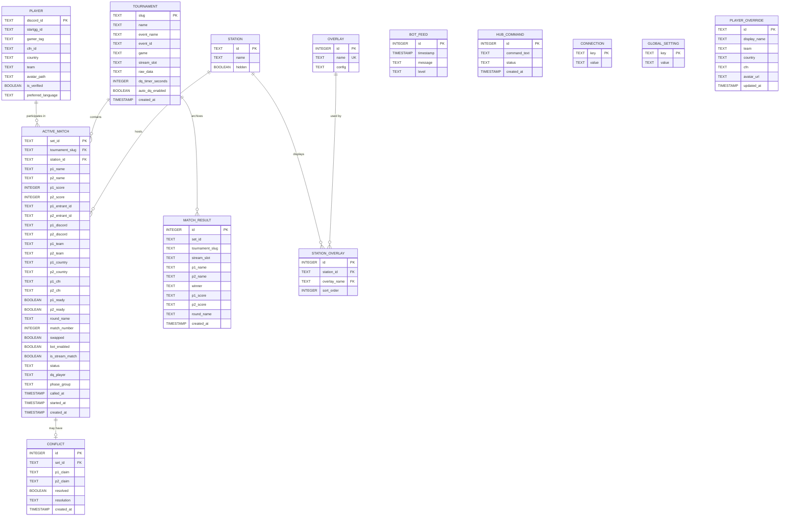
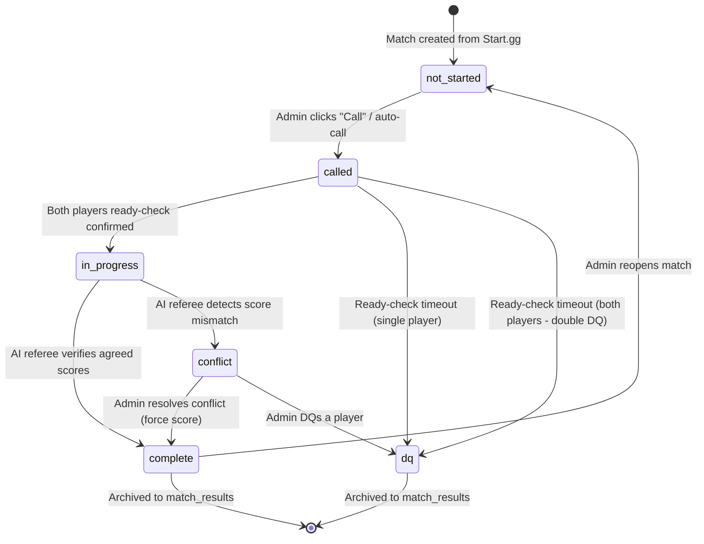
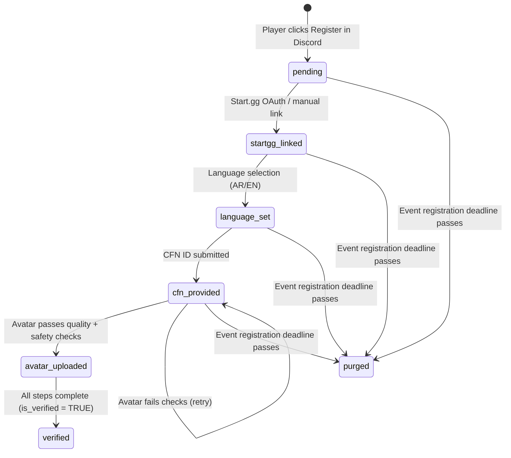

# Data Model: AI Tournament Organizer Platform

**Date**: 2026-05-16
**Feature**: `001-define-tournament-bot`

## Entity Relationship Diagram

## State Transitions

### Match (ACTIVE_MATCH.status)

### Player Registration (PLAYER.is_verified)

## Validation Rules

| Entity | Field | Rule |
|--------|-------|------|
| Player | discord_id | Required, unique, TEXT primary key |
| Player | startgg_id | Optional until verified, unique when set |
| Player | cfn_id | Required for verified players |
| Player | avatar_path | Must pass dimension check (min 100x100px) and AI safety scan |
| Player | preferred_language | Must be 'ar' or 'en', default 'ar' |
| Tournament | slug | Required, unique, TEXT primary key |
| Tournament | dq_timer_seconds | Default 600 (10 min), configurable per event |
| Active Match | set_id | Required, unique, from Start.gg |
| Active Match | status | One of: not_started, called, in_progress, complete, conflict, dq |
| Active Match | p1_score, p2_score | Non-negative integers, default 0 |
| Conflict | set_id | Must reference an existing active match |
| Bot Feed | level | One of: info, warn, error |
| Overlay | name | Required, unique |
| Overlay | config | JSON string with element positions, sizes, styles |
